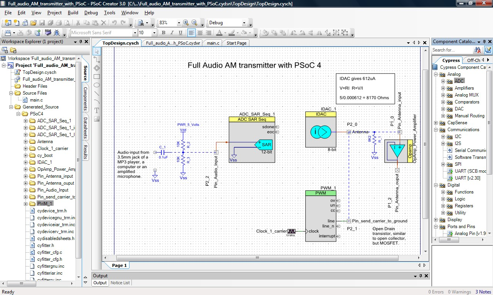
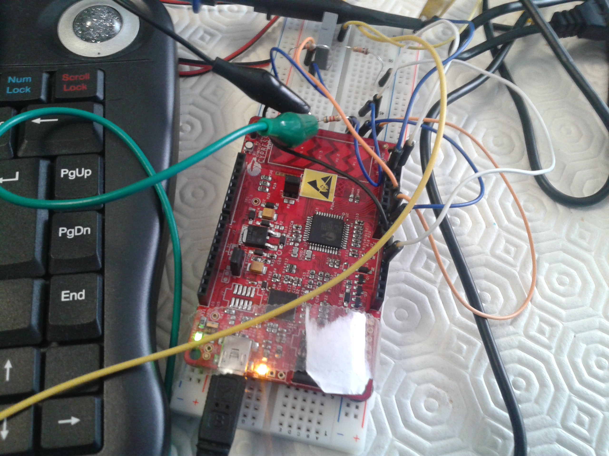

# Cypress PSoC 4 Full 1MHz Audio AM Transmitter in a Pioneer board
A small range AM transmitter 1 to 1.5 meters.

# Description
This is a small AM transmitter with a small range but it works fine and has a clear sound. The frequency is 1MHz and the input is a 3.5 audio jack.  
The Cypress PSoC 4 is an ARM Cortex M0 running at 48MHz with 32 bits and the board used is the PSoC 4 Pioneer. This micro-controller has 4 parallel blocks that are somewhat similar to a extra small FPGA, and have many analog peripherals, like OpAmps, comparators, ADC's and current DAC’s.
The IDE that I used to develop this project in C was PSoC Creator 3 and it is completely free. The programming is a mix od C code and graphical configuration of the hardware peripherals in the chip.  

# Peripherals configuration and schematic
  

# The development board used
[CY8CKIT-042 PSoC® 4 Pioneer Kit](https://www.cypress.com/documentation/development-kitsboards/cy8ckit-042-psoc-4-pioneer-kit)

# How it all works
In this section the fun part begins!  
To contextualize you, in this moment while I write this, I have Youtube playing a video of the music “Asturias” performed by Isaac Albeniz. The audio signal goes out of my computer through the phones jack cable and into the Pioneer development board pin, it is broadcast through a wire over RF signal with AM modulation. And a small radio is 30cm distance that is tunned to 1MHz in the AM band, picks the signal up and I can ear the lovely music by Isaac Albeniz.  
 
I can ear in the background a little noise, but it's quiet and gives a pleasant analog ambience to the moment.   
This program is very simple it only has 50 lines code (you can see the file main.c), the other files are generated automatically by the development tool, depending on the configurations that I made in the GUI for each hardware peripheral.  
I suggest that we do the signal path so that you can understand the simplicity of this solution.  
I would like ask you to please see the above diagram image, the signal input is on the left and it outputs to the right, after seeing it continue with the explanation.  
 
Ok, let's begin.....The audio signal with music or voice goes out from the phones jack of the PC (or MP3 Player) and electrically it's a voltage that changes with time, going up and down centered at zero volts and with an amplitude of -2 to +2 Volts. The first step that we have to make is to convert this voltage that changes with time (analog signal) to a variable inside our program, that is we need to use an Analog to Digital Converter (ADC) that our micro-controller has and that you can see in the above diagram. Our ADC can read value between 0 and 5 Volts (that's the voltage of our Pioneer dev board, it's configurable to 5V or 3.3V). To read that we need to convert the electrical signal of -2V to 2V in a signal from 0V to 5V, for that we use a capacitor and two resistors (voltage divider) to set the new central point of the signal. The capacitor only let's pass trough the AC component of the signal (the oscillations in the signal), blocking the DC component (the fixed center voltage point). This makes the bridge (decoupling) between two different DC circuit points. The two resistors are there to center the voltage on 2.5 Volts, so that the ADC is working on it's maximum range possible.     
 
Knowing that we already have the intervale of values (the range), that can be sampled by the ADC, we are going to configure the ADC so that it is continually converting the analog input signal into a digital sampled value. The audio signal that we want to convert is between 20Hz and 20KHz. Using the Nyquist theorem, we know that we have to sample the signal at the double of the rate that of it's maximum frequency, so we need the ADC to work at 40K Samples / second. Ideally we would use a low pass filter to remove the possibility of aliasing artefacts, but the signal outputted from the PC is already band limited.        
Because the minimum frequency of the ADC clock is 1MHz, the minimum frequency that I could configure the sampling rate was 72K Samles / second, it is greater then 40KS/s but it works fine. The value that we read with the ADC is an integer between 0 and 4095 in which a value of 0 corresponds to 0 Volts and a value of 4095 correspond to 5 Volts (12 bit's ADC).  
Knowing that we have a digital value of the signal, let's see what we can do with it inside our program.  
  
Inside our program (main.c) we will start to call the functions XXXXX_start(), to initialize each peripheral that we are going to use in the chip, with the configurations that we did in the GUI. Then we are going into a infinite loop ( for(;;) ) in which we are going to read the last value that was converted of the ADC peripheral (don't forget that the ADC is converting continually), after that we are going to scale the value (amplify it) multiplying it by 1.7x and after that we are going to write the value that is a number between 0 and 4095 (12 bits ADC - Analog to Digital Converter) into a number between 0 and 255 (8 bits DAC - Digital to Analog Converter).  
So we write the value into the current DAC (IDAC).  
Then we wait between 20us to 25us (microseconds), that is the minimum period of a sample at 40K Samples/s, and the loop returns o the beginning to another "ride in the carrousel" ad infinitum..... 
 
Regarding the diagram, we can see the IDAC, that is a DAC that can source a current corresponding to a value between 0 and 255 (there are VDAC's that can source voltage but our PSoC 4 model only only has a IDAC), and because we need to output a changing voltage we need to transform the changing current generated into a voltage by using a resistor.    
To calculate the value for the resistor we use R = V/I (the Ohms law), for the value of maximum voltage and maximum current, that is V = 5 Volts e I = 610uA (micro Amperes).  
At that position in the circuit we are going to have a changing voltage identical to the input signal but amplified, with a greater amplitude. Then we need to modulate the signal in AM with a carrier of 1MHz that will be the RF (radio frequency) signal that we are going to transmit.  
To do that, we will use a technique that is .... at the frequency of 1MHz turn ON and OFF one transistor (This is done inside the mic ro-controller in the pin mode Open Drain Low and Open Drain High) in open drain (like it was open collector in Bipolar but for the MOSFET kind of transistor) that will pull the signal to ground, 0 volts and in the next instant (square wave) we let the signal pass through, without pulling it down to ground, passing unchanged with the correct analog voltage of the music signal amplitude at that instant.  
With this, we successfully do an AM modulation (Amplitude Modulation) of an audio signal over the RF (Radio Frequency) signal at 1MHz.  
 
At this moment we can already put the antenna at the output of the resistor (in my case a wire of 50 centimeters, but in a ideal setting it should be an integer fraction of the wave length corresponding to the 1MHz frequency). Although at the maximum we will be generating a voltage of 5 Volts with a current of 610uA (micro Amperes), and that is really to little for our very inefficient antenna at this frequency. In order to ear anything in our portable radio at a distance of 1 meter. We could only ear if the antenna of the radio was almost touching the plastic cover of the wire.  
 
To solve this problem we can amplify in a small way the current of the signal with an internal OpAmp that the micro-controller has, in a configuration of a buffer (follower) in which the voltage gain is 1x, that is the voltage stays the same of it's input, but the current that it can source passes from 610uA (micro Amperes) to a theoretical max of 10mA (mili-Amperes), an increase of 16x in the current. But like I say in the Disclaimer in practice it only transmits at a distance of 1 to 1.5 meters max and I only used it for a small period to test if the technique worked.  
 
Like I said the code is very simple and I decided to make this project in this way just to prove the capabilities of PSoc 4 with an interesting example but with a very simple design. To technically improve the project, for the more purists, we could put one timer triggering an interrupt with a period of 1/40K of a second and when the interrupt were triggered we would do a conversion in the ADC (not being in continues mode, free run) then we would do the amplification in the same way and after that we would write in the same form to the IDAC. That solution would be a little more elegant in technical terms, but because the objective was to make simple and interesting project with the PSoC 4 and to explain it in the simplest way possible I followed this simple design.

# Disclaimer
To transmit RF signal it's necessary to check with the authorities of your country, the police of the RF - Radio Frequency. I could only do this because the signal strength of the output is so small and the antenna is very inefficient at this frequencies (one really simple small wire), it doesn't transmit to my portable radio over a distance of more than 1 to 1.5 meters. So it didn't interfere with nothing else and I only turned it on to know if the technique worked. This project was made back in 2014 and that was when I wrote this explanation to some friends in an email while listening to one song of Albeniz :-D

# To learn more about Electronics and micro-controllers....
Go to my github page [How to learn modern electronics](https://github.com/joaocarvalhoopen/How_to_learn_modern_electronics)

# License
MIT Open Source license.

# Have fun!
Best regards,  
Joao Nuno Carvalho  